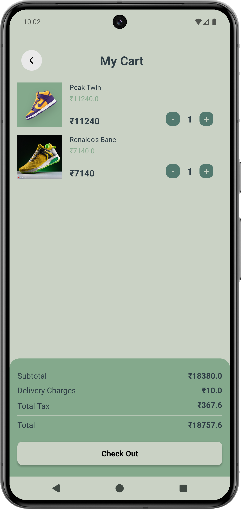

# Urban Step - E-Commerce Application | [Website](https://yourwebsite.com)

## Introduction

Urban Step is a feature-rich e-commerce application designed for seamless shopping experiences. The app allows users to discover brands, manage their carts, complete payments, and track their orders, all within a user-friendly environment.

## Key Features
- Secure login and logout functionality to ensure user account safety
- Brand discovery feature to browse through multiple categories and brands
- Cart management allowing users to add, remove, and update items before checkout
- Integrated payment gateway for seamless and secure transactions
- User profile management with address, payment, and order history sections
- Wish list functionality for saving favorite items for later purchases

## Media Gallery

<!-- 2x3 Grid with Video and Images -->
<table style="width:100%;">
  <tr>
    <!-- First row: video + 2 images -->
    <td style="padding: 10px;">
      
    </td>
    <td style="padding: 10px;">
      
    </td>
    <td style="padding: 10px;">
      
    </td>
  </tr>
  <tr>
    <!-- Second row: 3 images -->
    <td style="padding: 10px;">
      
    </td>
    <td style="padding: 10px;">
      
    </td>
    <td style="padding: 10px;">
      
    </td>
  </tr>
</table>

## Technical Details
- **Architecture**: MVVM (Model-View-ViewModel) for maintainable code
- **Authentication**: Firebase Authentication for secure login/sign-out
- **Database**: Firebase Firestore for real-time product and order data management
- **Payment Gateway**: Integrated payment gateway for secure transactions
- **RecyclerView**: Efficient display of products with smooth scrolling

## Tools & Libraries
- **Languages**: Kotlin, Java
- **Database**: Firebase Firestore
- **Authentication**: Firebase Authentication
- **Payment Gateway**: Stripe API
- **UI/UX**: Material Design, Android Jetpack Components
- **Navigation**: Android Navigation Component for smooth user flow

## Outcomes
- Successfully developed a scalable e-commerce platform with modern mobile frameworks
- Enhanced user experience with efficient cart, checkout, and profile management
- Demonstrated expertise in integrating payment gateways and secure user authentication

## Key Challenges & Solutions
- **Challenge**: Managing large datasets for brands, products, and users
  - **Solution**: Used Firebase Firestore with pagination for efficient data management and fast loading
- **Challenge**: Securely handling payment transactions
  - **Solution**: Integrated Stripe API for secure and seamless payment processing

## Future Enhancements
- Adding support for multiple payment gateways like PayPal and Google Pay
- Introducing push notifications for order status updates
- Implementing advanced search and filter options for better brand and product discovery
